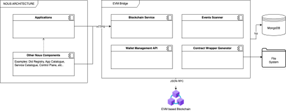

# Smart Contract Development and Deployment Platform

This application provides a complete workflow for developing, compiling, packaging, and deploying smart contracts on blockchain. The platform automates the generation of documentation, TypeScript wrappers to interact with contracts, and REST APIs that expose contract functionalities in an accessible way.

The repository contains three main components:

- A smart contracts project located in the [smart-contracts](./smart-contracts) folder, where smart contracts can be developed using Solidity and deployed through a TypeScript framework.
- The EVM-Bridge component located in the [evm-bridge](./evm-bridge) folder, which provides APIs to manage user wallets, interact with the blockchain and with smart contracts through auto-generated APIs derived from contract ABIs.
- A dockerized EVM-compatible node for development located in [evm-test-node](./evm-test-node), which allows testing smart contracts and the EVM-Bridge without needing public networks.

The EVM-Bridge component requires a database to index smart contract events and must be connected to an EVM-compatible blockchain node. Other applications and components can interact with the bridge using its HTTPS API.



## Prerequisites

To use this platform, the following components must be installed on the system:

- **Node.js version 18.0 or higher**: The application requires a modern version of Node.js that supports the features used by the project dependencies.
- **npm version 8.0 or higher**: Used as the package manager to install necessary dependencies.
- **Write permissions**: The system must allow creation and modification of files in project folders, especially in output folders where artifacts are generated.
- **Configured environment variables**: A `.env` file must be configured in the `smart-contracts` folder with blockchain connection parameters and private keys for deployment.

## Project Structure

The project is organized into three main directories that separate responsibilities and facilitate maintenance:

**smart-contracts/**: Contains all smart contract-related code, including Solidity source files, compilation scripts, wrapper generation, and deployment. Also includes unit tests and contract configuration logic.

**evm-bridge/**: Houses the web application backend that exposes automatically generated REST APIs. This directory contains controllers, models, services, and all necessary infrastructure to provide an HTTP interface to smart contracts.

**evm-test-node/**: Provides a local development environment with a test blockchain configured through Docker, allowing testing without needing to connect to public networks.

Within the `smart-contracts` folder, the most relevant directories are:

- `contracts/`: Stores Solidity smart contract source files
- `src/contract-wrappers/`: Contains automatically generated TypeScript wrappers
- `src/`: Includes all generation, compilation, and deployment scripts
- `build/`: Output directory where compiled artifacts are stored (ABI, bytecode, documentation)
- `dist/`: Contains transpiled TypeScript code ready to execute

## Key Concepts

**Smart Contract**: A smart contract is a program that runs autonomously on the blockchain. These contracts contain business logic that executes deterministically and transparently, allowing automation of agreements without intermediaries.

**Generated Documentation**: The system automatically extracts documentation from NatSpec comments included in Solidity code, generating JSON files with structured information about functions, events, and parameters of each contract.

**TypeScript Wrapper**: A wrapper is a TypeScript class that encapsulates smart contract functionalities, providing an object-oriented interface to interact with the contract from JavaScript/TypeScript applications. Wrappers automatically handle data serialization, transaction sending, and result decoding.

**Generated APIs**: These are REST endpoints automatically created based on public functions of smart contracts. These APIs allow web or mobile applications to interact with contracts through HTTP without needing to know blockchain details.

## Usage Instructions

### Step 1: Add the Smart Contract

The first step involves creating the Solidity smart contract file in the `smart-contracts/contracts/` folder. The file must follow Solidity conventions and can include NatSpec comments to generate automatic documentation.

Contracts should inherit from appropriate base classes according to their functionality. For upgradeable contracts, it's recommended to inherit from `BaseContract` located in `smart-contracts/contracts/base/BaseContract.sol`. Contracts can also implement interfaces defined in `smart-contracts/contracts/interfaces/`.

### Step 2: Build and Generate All Artifacts

Once the Solidity file is created, the build command must be executed to compile contracts and generate all necessary artifacts including TypeScript wrappers:

```bash
cd smart-contracts
npm run build
```

This command executes a complete build process that includes:
- Cleaning the build directory
- Compiling all Solidity contracts to generate bytecode and ABIs
- Extracting documentation from NatSpec comments
- Generating TypeScript wrapper classes for all contracts
- Creating consolidated documentation files
- Copying wrappers to the backend project

The generated TypeScript wrappers are created in the `smart-contracts/src/contract-wrappers/` folder with names following the kebab-case convention derived from the contract name. Each wrapper includes methods for all public contract functions, both read-only and write operations, as well as auxiliary functions for contract deployment and event listening.

### Step 3: Configure the Contract in contracts.ts

After generating wrappers, the new contract must be registered in the `smart-contracts/src/contracts.ts` file. This file defines which contracts will be deployed and how they will be initialized.

In the `DeployedContracts` type, a new entry with a descriptive key and the corresponding wrapper type must be added. In the `SMART_CONTRACTS` object, a configuration including the following must be added:

- `contractName`: The exact contract name as it appears in the Solidity file
- `wrapper`: The wrapper class imported from `src/contract-wrappers/`
- `deploy`: Optional function for custom deployment logic
- `initialize`: Optional function to initialize the contract after deployment
- `notUpgradeable`: Optional boolean to indicate if the contract is not upgradeable

### Step 4: Compile and Generate All Artifacts

The next step executes the complete compilation flow and generation of all necessary artifacts:

```bash
cd smart-contracts
npm run build:all
```

This command sequentially executes several subcommands that perform different tasks:

- `compile`: Uses the Solidity compiler to generate bytecode and ABI of all contracts, storing results in the `build/` folder
- `gen-doc`: Extracts NatSpec documentation from contracts and generates JSON files with structured information
- `generate-contract-wrappers`: Regenerates all TypeScript wrappers based on compiled ABIs
- `gen-doc-file`: Creates a consolidated documentation file in Markdown format
- `update-backend-wrappers`: Copies generated wrappers to the backend project
- `update-backend-code`: Automatically generates API controllers, models, and configurations in the backend project

Generated artifacts are distributed to different locations: compiled files go to `build/`, transpiled TypeScript code to `dist/`, and backend files are updated in the `evm-bridge/src/` folder.

### Step 5: Deploy the Contracts

Finally, to deploy contracts to the configured blockchain, execute:

```bash
cd smart-contracts
npm run deploy
```

This command executes the script located in `smart-contracts/src/index.ts`, which in turn calls the `deploySmartContracts` function defined in `smart-contracts/src/contract-deployment.ts`. The script connects to the blockchain specified in environment variables, deploys all contracts configured in `contracts.ts`, and executes corresponding initialization functions.

The deployment process uses the ERC1967 proxy pattern for upgradeable contracts, allowing modification of contract logic in the future without changing its address. Non-upgradeable contracts are deployed directly without a proxy.

## Code Examples

### Basic Smart Contract Structure

```solidity
// SPDX-License-Identifier: MIT
pragma solidity ^0.8.0;

import "./base/BaseContract.sol";

contract MyContract is BaseContract {
    uint256 private value;
    
    event ValueChanged(uint256 newValue);
    
    function initialize(uint256 _initialValue) public initializer {
        __BaseContract_init();
        value = _initialValue;
    }
    
    function setValue(uint256 _newValue) public {
        value = _newValue;
        emit ValueChanged(_newValue);
    }
    
    function getValue() public view returns (uint256) {
        return value;
    }
}
```

### Configuration in contracts.ts

```typescript
import { MyContractWrapper } from "./contract-wrappers/my-contract";

export type DeployedContracts = {
    myContract: MyContractWrapper,
};

export const SMART_CONTRACTS = {
    myContract: {
        contractName: "MyContract",
        wrapper: MyContractWrapper,
        initialize: async (contracts, txOptions) => {
            await contracts.myContract.initialize(100, txOptions);
        }
    }
};
```

### Using the Generated Wrapper

```typescript
import { MyContractWrapper } from "./contract-wrappers/my-contract";
import { createProvider } from "@asanrom/smart-contract-wrapper";

const provider = createProvider("http://localhost:8545");
const contract = new MyContractWrapper(provider, "0x...");

const currentValue = await contract.getValue();
const tx = await contract.setValue(200, { gasLimit: 100000 });
```

## Common Errors and Solutions

**Solidity compilation error**: If errors appear during compilation, verify that the contract syntax is correct and all imports are available. Base files are located in `smart-contracts/contracts/base/` and interfaces in `smart-contracts/contracts/interfaces/`.

**Wrapper not found after generation**: Ensure the contract name in the Solidity file exactly matches what's specified in `contracts.ts`. Names are case-sensitive.

**Deployment error due to insufficient gas**: Properly configure environment variables related to gas limit and gas price in the `.env` file. Also verify that the deployment account has sufficient funds.

**APIs not generated in backend**: Verify that the `update-backend-code` command executed correctly and that backend project paths are properly configured in generation scripts.

**File write permission error**: On Windows systems, running the terminal as administrator may resolve permission issues. On Unix systems, verify that the user has write permissions in project folders.

**Failed blockchain connection**: Check that the RPC node URL is correctly configured in the `.env` file and that the node is accessible from the development machine.

## Final Notes

This platform is designed to facilitate iterative smart contract development, providing an automated workflow that reduces technical complexity. The modular architecture allows extending functionality by adding new generators or modifying existing ones according to specific project needs.

For more information about the tools used, consult the official documentation of [Solidity](https://docs.soliditylang.org/), [smart-contract-wrapper](https://github.com/AgustinSRG/smart-contract-wrapper), and [TypeScript](https://www.typescriptlang.org/docs/).

Additional technical documentation can be found in the `smart-contracts/README.md` folder for specific details about contract configuration and development, and in `evm-bridge/README.md` for information about the application backend.

## License

This project is under the [MIT License](./LICENSE).
