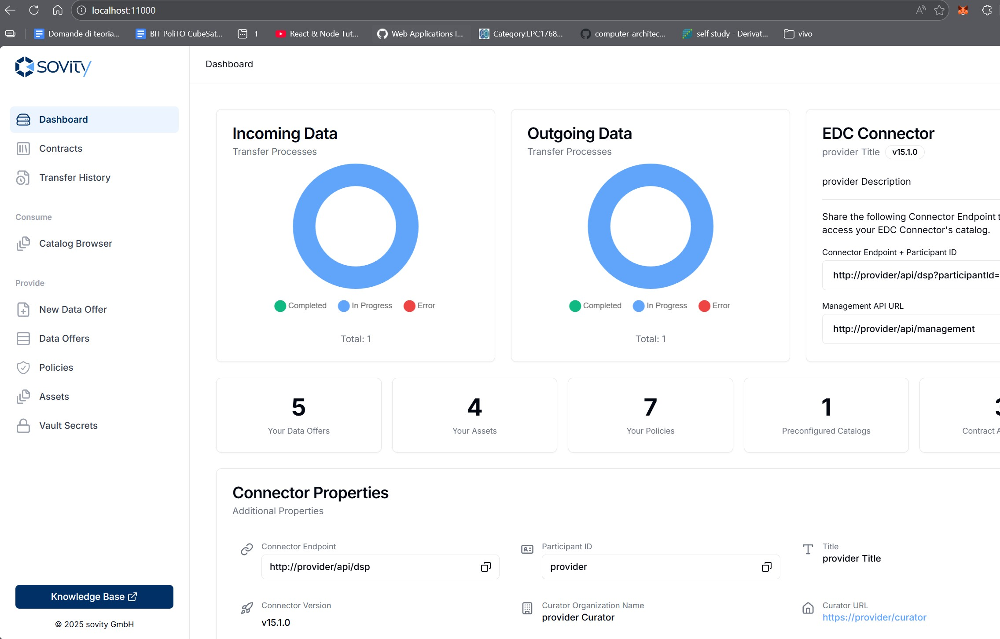
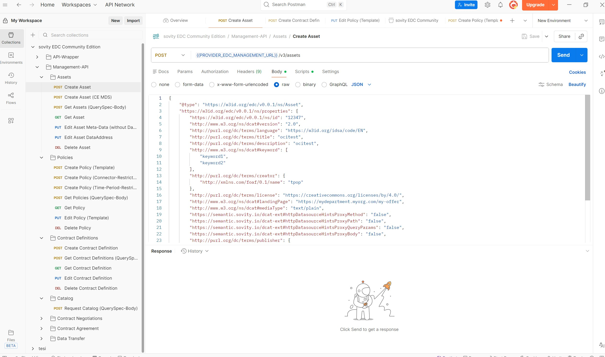

# PoC Blockchain – NOUS  
**poc-blockchain-nous**

A blockchain-based **Proof of Concept (PoC)** for vulnerable road user (VRU) safety systems, leveraging **Ethereum Virtual Machine (EVM)** technology, **5G Mobile Edge Computing (MEC)**, and **distributed ledger technologies**.

---

## Overview

This repository contains a comprehensive Proof of Concept focused on improving **road safety for vulnerable road users** (pedestrians, cyclists, etc.) by combining:

- Blockchain-based trust and data integrity  
- 5G Mobile Edge Computing for low-latency processing  
- Event-driven architectures for real-time safety alerts  

The project explores how decentralized services can support **accident prevention**, **secure data sharing**, and **cross-platform interoperability**.

---

## Architecture Components

### Requirements
- **Node.js** – 
- **Docker desktop** – 


### Core Services

| Component | Description |
|---------|-------------|
| **evm-bridge-main** | Ethereum Virtual Machine bridge for cross-chain interoperability |
| **ganache** | Local blockchain network for development and testing |
| **minio** | High-performance object storage for data management |
| **sovity** | Integration with Sovity platform services |
| **webhook-server** | Node.js webhook server for real-time event processing |


---

##  Key Documentation

- **Grant Agreement** – Horizon Europe Grant Agreement (GAP-101135927)
- **Project Proposal** – Detailed project scope and objectives
- **5G MEC Architecture** – Technical design for Mobile Edge Computing
- **Vulnerable Road User Safety** – Research on accident prevention systems
- **UML Diagrams** – System architecture and workflow diagrams

---

## 🏗️ Architecture Overview

The system is composed of four main components:

- **EDC Consumer node** (e.g. `localhost:11000`)
- **EDC Producer node** (e.g. `localhost:22000`)
- **Webhook / Relayer**
- **Ethereum Smart Contract**

All blockchain interactions are mediated by the webhook, which listens to EDC management API events
and records normalized metadata on-chain.

The architecture intentionally uses:

- ✔️ **One smart contract**
- ✔️ **One ABI**
- ✔️ **One unified interaction model**

This avoids:
- duplicated logic
- contract version fragmentation
- inconsistent data models across participants

Both Consumer and Producer interact with the **same contract interface**, ensuring consistency
and ease of maintenance.

---

## 🧩 Node-scoped Identity with `nodeId`

In a dataspace, identifiers such as `assetId`, `policyId`, or `offerId` are **local to each participant**.
Different nodes may legitimately generate identical identifiers.

To prevent collisions, every on-chain entity is uniquely identified by the composite key:

Where:
- `nodeId` is a logical identifier of the participant node
- `localId` is the identifier generated by the EDC component

This guarantees:
- no collisions between Consumer and Producer
- independence of participant namespaces
- correct modeling of dataspace autonomy

---

## 🔐 Logical Identity vs On-chain Sender

The design explicitly separates two concepts:

| Concept | Description |
|------|-----------|
Logical Node Identity | `nodeId` (stored on-chain) |
On-chain Sender | `msg.sender` (the webhook / relayer wallet) |

In the current prototype:
- all transactions originate from a trusted relayer
- node identity is preserved via `nodeId`

This approach enables:
- simple prototyping
- full auditability
- future migration to per-node cryptographic signatures without changing the contract interface

---

## 🪝 Unified Webhook Layer

A **single webhook** handles events coming from all EDC nodes.

The processing logic is identical for all participants and is parameterized only by:
- the detected node (`nodeId`)
- the incoming EDC event type

This design:
- avoids duplicated code paths
- ensures consistent behavior
- simplifies debugging and testing

---

## 🌐 Realistic Dataspace Modeling

The architecture reflects real dataspace principles:

- Nodes are autonomous
- Consumer and Producer are **roles**, not fixed identities
- A single node may act as both Consumer and Producer
- New participants can join dynamically

No smart contract redeployment is required when:
- a new node is added
- a node changes role
- identifiers overlap across participants

---


##  Quick Start

### Prerequisites

Make sure the following tools are installed:

- Node.js (check individual component requirements)
- Docker (recommended)
- Postman
- Git

---

##  Setup Instructions

### STEP 1: Clone the Repository

```bash
git clone https://github.com/<your-org>/poc-blockchain-nous.git
cd poc-blockchain-nous

```
### STEP 2: Initialize EVM Bridge & Deploy Smart Contracts
The EVM Bridge setup, test node initialization, and smart contract deployment are maintained in a separate repository.

Please follow the official tutorial here:
https://gitlab.eclipse.org/eclipse-research-labs/nous-project/common-administration-services/decentralised-services/evm-bridge/-/tree/main?ref_type=heads

This guide covers:

Initializing the local blockchain test node

Deploying smart contracts on-chain

Verifying the deployment

### STEP 3: Start the Webhook Server
Before starting the webserver please fill right:

your WALLET PRIVATE KEY in the .env file present in the folder webhook-server


edit the index.js line 111 const CONTRACT_ADDRESS = "0xd0fc4e931b6d67bcecc65c2afec2faa278d0d769" with your own deployed contract address

```bash
cd webhook-server
node index.js
```

### STEP 4: How to Test
To test the end-to-end workflow, REST APIs are used to simulate user behavior.

Before proceeding, please review the Dataspace Documentation (2).docx located in the root directory of this repository, as it describes the expected workflow and API interactions.

Sovity has provided a Postman API collection that can be used to execute and validate the required REST calls.

To start the Sovity components, a local demo deployment was used for testing and POC purposes.

Please refer to the official Sovity documentation for detailed setup instructions:
https://github.com/sovity/edc-ce/tree/main/docs/deployment-guide/goals/local-demo-ce

After starting local demo throught Docker you can see at [localhost 11000](http://localhost:11000/)  this frontend:


### Implemented Actions

| ACTION | COMPONENTS |
|---------|-------------|
| **ADD** | ASSET,POLICY,DATA OFFER,DATA CONTRACT |
| **MODIFY** | ASSET,POLICY,DATA OFFER,DATA CONTRACT |
| **DELETE** |  |

After Loading POSTMAN API COLLECTION WE CAN SEE following screen 



THE REST API Disponible to test are :
| API | URL |
|---------|-------------|
| **CREATE ASSET POST** | {{PROVIDER_EDC_MANAGEMENT_URL}}/v3/assets |
| **EDIT ASSET METADATA(WITHOUT DATAADRESS) PUT** | {{PROVIDER_EDC_MANAGEMENT_URL}}/v3/assets |
| **CREATE POLICY POST** |{{PROVIDER_EDC_MANAGEMENT_URL}}/v3/policydefinitions  |
| **CREATE POLICY (TIME-PERIOD-RESTRICTION) POST** |{{PROVIDER_EDC_MANAGEMENT_URL}}/v3/policydefinitions  |
| **EDIT POLICY (TEMPLATE) POST** |{{PROVIDER_EDC_MANAGEMENT_URL}}/v3/policydefinitions/{POLICY ID}  |
| **CREATE CONTRACT DEFINITION POST** | {{{PROVIDER_EDC_MANAGEMENT_URL}}/v3/contractdefinitions |
| **EDIT CONTRACT DEFINITION PUT** | {{{PROVIDER_EDC_MANAGEMENT_URL}}/v3/contractdefinitions |
| **START NEGOTIATION POST** | {{CONSUMER_EDC_MANAGEMENT_URL}}/wrapper/ui/pages/catalog-page/contract-negotiations |
| **TERMINATE NEGOTIATION POST** | {{CONSUMER_EDC_MANAGEMENT_URL}}/wrapper/ui/pages/content-agreement-page/CONTRACT AGREEMENT ID/terminate |
| **START DATA TRANSFER POST** | {{CONSUMER_EDC_MANAGEMENT_URL}}/ |
| **TERMINATE DATA TRANSFER POST** | {{CONSUMER_EDC_MANAGEMENT_URL}}/ |


THE POST RESPONSE SCRIPT TO ADD FOR redirecting to the webhook:
```bash
let responseData = {};
try {
    responseData = pm.response.json();
} catch (e) {
    responseData = { raw: pm.response.text() };
}

// Extract target port (11000 / 22000)
let requestUrl = pm.request.url;
let port = requestUrl.port ? requestUrl.port.toString() : null;

// Build payload
let logPayload = {
    request: {
        method: pm.request.method,
        url: requestUrl.toString(),
        port: requestUrl.toString(),                // ← ADDED HERE
        body: pm.request.body ? pm.request.body.toString() : null
    },
    response: responseData,
    timestamp: new Date().toISOString()
};

// Send webhook to Express
pm.sendRequest({
    url: "http://localhost:3000/event",
    method: "POST",
    header: { "Content-Type": "application/json" },
    body: {
        mode: "raw",
        raw: JSON.stringify(logPayload)
    }
}, function (err, res) {
    if (err) {
        console.log("❌ Errore invio log al webhook:", err);
    } else {
        console.log("✅ Log inviato al webhook:", res.json());
    }
});
```

---


## 🔮 Event-driven and Kafka-based Architecture


In this model, EDC events would no longer be handled synchronously by a single webhook, but instead published
to dedicated Kafka topics (e.g. `asset-events`, `policy-events`, `dataoffer-events`).
A set of independent consumers would then process these events asynchronously and trigger the corresponding
on-chain transactions.

This evolution would provide several advantages:

- **Decoupling** between EDC nodes and blockchain interaction logic  
- **Horizontal scalability** through multiple event consumers  
- **Fault tolerance and replayability** via Kafka’s persistence model  
- **Improved observability** and monitoring of event flows  
- **Clear separation of concerns** between event ingestion, normalization, and on-chain execution  

The smart contract and ABI would remain unchanged, as the `nodeId`-based design already supports multiple
independent producers of events.

By adopting a Kafka-based solution, the system could scale to large dataspaces with many participants and
high event throughput, while preserving the same on-chain semantics and audit guarantees.

### STEP 1: Test Setup

From the folder kafka perform following command:


```bash
docker compose up -d
```

From the webhook-server directory perform following command to start producer :

```bash
node indexkafka.js
```

From the webhook-server/kafka directory perform following command to start consumer:

```bash
node consumer.js
```

### STEP 2: Test flow

Perform allowed POSTMAN API from the upside section 

---

## 🔮 Integrated Test with MASA USECASE
The validation process consists of several operational stages. 
First, a file containing cinematic metadata is uploaded to a local MinIO bucket as part of the data staging phase. 
Next, following the logic of the NOUS PoC, REST API calls are issued to the Provider Connector to configure the Asset, Access Policy, and Contract Definition. 
After the negotiation is completed, the Consumer receives the Endpoint Data Reference (EDR), and the validation script (active webhook) 
uses the protected URL provided to download the file. The function then computes a SHA-256 hash of the downloaded binary content. 
Finally, the hash and asset metadata are submitted to the smart contract on Hyperledger Besu for on-chain notarization.